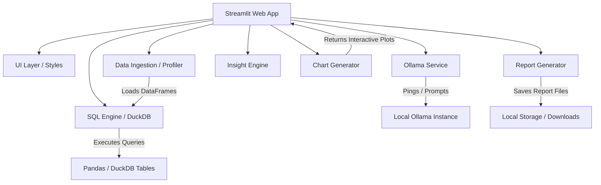

# 📊 Local LLM Data Analyst

[](https://github.com/yourusername/local-llm-data-analyst/actions)
[](https://www.python.org/)
[](https://github.com/astral-sh/ruff)
[](https://github.com/python/mypy)
[](LICENSE)

A production-grade, recruiter-ready **Local LLM Data Analyst** workspace designed for automated data profiling, natural language SQL analytics, interactive charting, and executive summary generation. The application runs **100% locally** using **Ollama** and **DuckDB**, ensuring data privacy and zero API costs.

*Built as a capstone project for B.Sc Data Science portfolios to showcase software engineering, AI integration, and database analytics skills.*

---

## 🚀 Key Features

- **📂 Ingestion & Parsing**: Upload CSV, XLSX, XLS, and Parquet files. DataFrames are cached in-memory.
- **📊 Automatic Profiling**: Computes row/column shapes, data types, missing value percentages, duplicate counts, memory usage, and outliers using the Interquartile Range (IQR) method.
- **🔍 NL-to-SQL Analytics Studio**: Asks plain English questions, translates them into optimized DuckDB SQL, executes them in-memory, and provides executive-friendly explanations of the findings.
- **📈 Visual Advisor**: Generates premium interactive Plotly charts (Bar, Line, Scatter, Histogram, Correlation Heatmaps, and Pies) styled with dark-mode glassmorphic themes.
- **🤖 Analytical AI Chat**: Maintain conversations with Ollama models (`qwen2.5-coder:7b` or `llama3.3`) with sliding-window turn-level memory.
- **💡 Executive Insights Briefing**: Automatically synthesizes metadata to extract trends, anomalies, patterns, and actionable strategic recommendations.
- **📥 Report Generator**: Export briefing documents to Markdown, HTML, or print-ready PDF files.

---

## 🛠️ Tech Stack & Dependencies

- **Core**: Python 3.12+, `uv` Package Manager.
- **Frontend / Dashboard**: Streamlit (SaaS Custom Dark/Glassmorphic CSS).
- **In-Memory SQL Database**: DuckDB.
- **Data Wrangling**: Pandas, NumPy, PyArrow.
- **Interactive Visualizations**: Plotly Express.
- **Local LLM Orchestration**: Ollama (direct REST API connection).
- **Report Generation**: fpdf2 (PDF), Markdown, HTML.
- **Quality Assurance**: Pytest (Unit Tests), Ruff (Linter & Formatter), MyPy (Strict Type Safety), Pre-Commit.

---

## 🏗️ Architecture Blueprint



---

## 📦 Folder Structure

```text
├── app/
│   ├── main.py              # Application entrypoint & view coordinator
│   ├── ui/                  # Stylesheets, HTML templates, KPI widgets
│   ├── services/            # Ollama service manager & lifecycle checks
│   ├── llm/                 # Chat engines and turn-level sliding memory
│   ├── analytics/           # Profiling calculations, DuckDB SQL executor
│   ├── charts/              # Plotly chart visualization advisor
│   └── reports/             # HTML, MD, and PDF report exporters
├── tests/                   # 29 Pytest unit tests for all layers
├── docs/                    # Architectural setup, deployment, & contributing guides
├── .github/workflows/       # GitHub Actions CI validation pipeline
├── pyproject.toml           # Project metadata and lint rules
└── uv.lock                  # UV dependency lockfile
```

---

## ⚡ Quick Start (Run Locally)

### 1. Prerequisites
Make sure you have [Ollama](https://ollama.com/) installed and running, and install the `uv` package manager:
```bash
# Windows (PowerShell)
powershell -ExecutionPolicy ByPass -c "irm https://astral.sh/uv/install.ps1 | iex"

# macOS / Linux
curl -LsSf https://astral.sh/uv/install.sh | sh
```

### 2. Download local LLM
```bash
ollama pull qwen2.5-coder:7b
```

### 3. Clone and Run
```bash
# Clone the repository
git clone https://github.com/yourusername/local-llm-data-analyst.git
cd local-llm-data-analyst

# Sync dependencies and build virtual environment
uv sync

# Run Streamlit dashboard
uv run streamlit run app/main.py
```

---

## 🧪 Testing & Code Quality

Verify that all type annotations, formatting, and unit tests pass before proposing updates:

```bash
# Run Ruff lint check & format
uv run ruff check .
uv run ruff format .

# Run MyPy strict type checker
uv run mypy app tests

# Run all 29 pytest unit tests
uv run pytest tests/
```

---

## 🌟 Recruiter Portfolio Highlight

*This project is built using professional, production-grade software engineering practices. Below are points you can put directly onto your resume or speak to in interviews:*

### Resume Bullet Points
- **AI Analytics Engineer / Developer**:
  - Engineered an in-memory SQL data analyst pipeline using **Streamlit**, **DuckDB**, and **Pandas**, enabling instant natural language analytics on multi-format tables (CSV, Excel, Parquet).
  - Integrated local LLMs (**Ollama/Qwen2.5-Coder**) using custom REST API wrappers, achieving 100% data privacy and 0 inference API costs.
  - Built an automated **Data Profiler** and **Insight Engine** generating data shape, duplicates, IQR outliers, and exporting briefings to custom A4 PDFs using **fpdf2**.
  - Established a robust testing framework with **29 pytest unit tests** (mocking LLM services) and set up a **GitHub Actions CI Pipeline** running Ruff, MyPy, and Pytest on every push.

---

## 🔮 Future Roadmap
- **💾 Local Vector Storage**: Add a vector database (e.g. ChromaDB) to perform RAG over metadata.
- **🔌 Additional DB Connectors**: Add database integrations (PostgreSQL, SQLite, Snowflake).
- **🚀 Advanced GPU Acceleration**: Integrate multi-GPU load balancing for Ollama instances.

---

## 📄 License
This project is licensed under the MIT License - see the [LICENSE](LICENSE) file for details.

---

## 👤 Author
- **Your Name** - *Data Scientist & AI Engineer* - [GitHub](https://github.com/yourusername)
