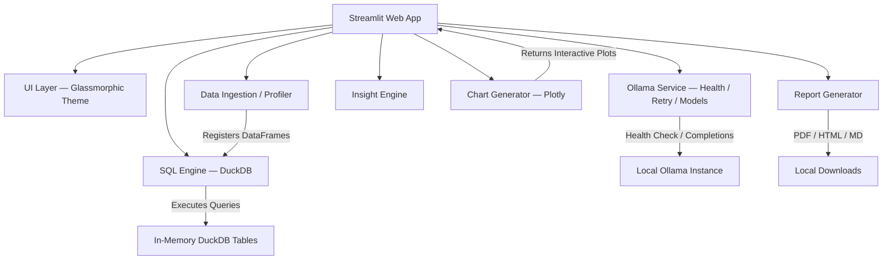

# 📊 Local LLM Data Analyst

<div align="center">

[](https://github.com/yourusername/local-llm-data-analyst/actions)
[](https://www.python.org/)
[](https://github.com/astral-sh/ruff)
[](https://github.com/python/mypy)
[](LICENSE)
[](https://ollama.com/)

**A production-grade, recruiter-ready local AI data analyst workspace.**

*Automated data profiling • Natural language SQL • Interactive charting • Executive summaries*

*100% local inference via Ollama — zero API costs, total data privacy.*

</div>

---

## 🎯 Overview

Local LLM Data Analyst is a full-stack data analysis workspace that runs entirely on your machine. Upload datasets, ask questions in plain English, generate interactive visualizations, and compile executive briefings — all powered by local LLMs through Ollama with DuckDB as the in-memory SQL engine.

Built as a **portfolio capstone project** for B.Sc Data Science graduates targeting roles in:

- 🔬 Data Analyst / Analytics Engineer
- 🤖 AI Engineer / LLM Engineer
- 📊 Junior Data Scientist

---

## 🖼️ Screenshots

> Add screenshots to the `assets/` directory and update the paths below.

<!-- Uncomment when screenshots are available:


-->

*Screenshots will be added after deployment.*

---

## 🚀 Key Features

| Feature | Description |
|---|---|
| **📂 Smart Ingestion** | Upload CSV, XLSX, XLS, and Parquet files with automatic schema detection |
| **📊 Auto Profiling** | Row/column shapes, data types, missing values, duplicates, memory usage, IQR outliers |
| **🔍 NL-to-SQL Studio** | Plain English → optimized DuckDB SQL → execution → executive explanation |
| **📈 Visual Advisor** | Plotly charts (bar, line, scatter, histogram, heatmap, pie) with dark-mode themes |
| **🤖 AI Chat** | Context-aware conversations with sliding-window turn-level memory |
| **💡 Executive Insights** | Automated trends, anomalies, patterns, and strategic recommendations |
| **📥 Report Generator** | Export briefings to Markdown, styled HTML, or print-ready PDF |
| **🔁 Retry Logic** | Exponential backoff for Ollama API resilience |
| **🔒 100% Local** | All processing on your machine — zero data leaves your device |

---

## 🛠️ Tech Stack

| Layer | Technology |
|---|---|
| **Runtime** | Python 3.12+, `uv` Package Manager |
| **Frontend** | Streamlit (Custom Glassmorphic Dark Theme) |
| **SQL Engine** | DuckDB (In-Memory) |
| **Data Layer** | Pandas, NumPy, PyArrow |
| **Visualization** | Plotly Express |
| **LLM Backend** | Ollama (REST API) |
| **Reports** | fpdf2 (PDF), Markdown, HTML |
| **Quality** | Pytest, Ruff, MyPy, Pre-Commit |
| **CI/CD** | GitHub Actions |

---

## 🏗️ Architecture



---

## 📦 Project Structure

```text
├── app/
│   ├── main.py              # Application entrypoint & view coordinator
│   ├── ui/                  # Custom CSS, HTML components, KPI widgets
│   │   ├── styles.py        # Premium glassmorphic design system
│   │   └── components.py    # Reusable UI components
│   ├── services/            # Ollama service (health, retry, models)
│   │   └── ollama_service.py
│   ├── llm/                 # Chat engine with sliding-window memory
│   │   └── chat_engine.py
│   ├── analytics/           # Profiler, DuckDB SQL engine, insights
│   │   ├── profiler.py
│   │   ├── sql_engine.py
│   │   └── insight_engine.py
│   ├── charts/              # Plotly chart generator & advisor
│   │   └── chart_generator.py
│   └── reports/             # Multi-format report exporter
│       └── report_generator.py
├── tests/                   # 29 pytest unit tests
├── docs/                    # Architecture, setup, deployment guides
├── assets/                  # Screenshots and media
├── .github/workflows/       # CI pipeline (Ruff, MyPy, Pytest)
├── .streamlit/config.toml   # Framework-level theme configuration
├── pyproject.toml           # Project metadata & tool config
├── uv.lock                  # Dependency lockfile
├── CHANGELOG.md             # Version history
├── SECURITY.md              # Security policy
├── LICENSE                  # MIT License
└── .env.example             # Environment variable template
```

---

## ⚡ Quick Start

### Prerequisites

- [Python 3.12+](https://www.python.org/)
- [Ollama](https://ollama.com/) installed and accessible
- [`uv`](https://docs.astral.sh/uv/) package manager

### 1. Install `uv`

```bash
# Windows (PowerShell)
powershell -ExecutionPolicy ByPass -c "irm https://astral.sh/uv/install.ps1 | iex"

# macOS / Linux
curl -LsSf https://astral.sh/uv/install.sh | sh
```

### 2. Pull a local LLM

```bash
ollama pull qwen2.5-coder:7b
```

### 3. Clone & Run

```bash
git clone https://github.com/yourusername/local-llm-data-analyst.git
cd local-llm-data-analyst

# Install dependencies
uv sync

# Copy environment template
cp .env.example .env

# Launch the dashboard
uv run streamlit run app/main.py
```

The app will open at `http://localhost:8501`.

---

## 🧪 Testing & Quality

```bash
# Lint & format
uv run ruff check .
uv run ruff format .

# Type checking
uv run mypy app tests

# Run all 29 unit tests
uv run pytest tests/
```

All checks run automatically on push via GitHub Actions CI.

---

## 🔐 Security

- **No data leaves your machine** — all LLM inference is local via Ollama
- **No secrets in code** — configuration via `.env` (excluded from git)
- **Dependency locking** — `uv.lock` ensures reproducible builds
- See [SECURITY.md](SECURITY.md) for the full security policy

---

## 🌟 Resume Bullet Points

> *Copy these directly to your resume or portfolio:*

- **AI Analytics Engineer**: Engineered an in-memory SQL data analyst pipeline using **Streamlit**, **DuckDB**, and **Pandas**, enabling instant natural language analytics on multi-format datasets (CSV, Excel, Parquet).
- **LLM Integration**: Integrated local LLMs (**Ollama/Qwen2.5-Coder**) with custom REST API wrappers, exponential backoff retry logic, and automatic health management — achieving 100% data privacy with zero inference costs.
- **Data Engineering**: Built an automated **Data Profiler** and **Insight Engine** that generates dataset metadata, IQR outliers, trend analysis, and exports executive briefings to custom A4 PDFs via **fpdf2**.
- **Software Engineering**: Established a robust testing framework with **29 pytest unit tests** (mocking LLM services), strict **MyPy** type checking, **Ruff** linting, and a **GitHub Actions CI Pipeline**.
- **UI/UX Design**: Designed a premium **glassmorphic dark theme** with animated gradients, micro-interactions, and responsive layouts using custom CSS in Streamlit.

---

## 🔮 Future Roadmap

- 💾 **RAG Pipeline**: Add ChromaDB for retrieval-augmented generation over metadata
- 🔌 **Database Connectors**: PostgreSQL, SQLite, Snowflake integrations
- 📊 **Dashboard Templates**: Pre-built analytical dashboards for common domains
- 🚀 **Multi-GPU**: Load balancing across multiple Ollama instances

---

## 📄 License

This project is licensed under the MIT License — see [LICENSE](LICENSE) for details.

---

## 👤 Author

- **Your Name** — *Data Scientist & AI Engineer* — [GitHub](https://github.com/yourusername)
