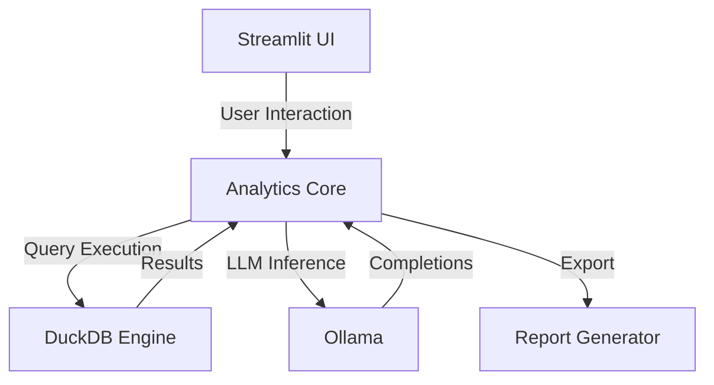

# 📊 Local Data Analyst

<div align="center">

[](https://github.com/Krishna-Meena/LLM-Driven-Data-Analyst-Assistant/actions)
[](https://www.python.org/)
[](https://github.com/astral-sh/ruff)
[](https://github.com/python/mypy)
[](LICENSE)
[](https://ollama.com/)

A locally-hosted data analysis workspace powered by LLMs.

Automated profiling · Natural language SQL · Interactive charts · Executive reports

</div>

---

## Overview

Upload datasets, query them in plain English, generate interactive visualizations, and export executive briefs — all running locally on your machine via [Ollama](https://ollama.com/) and [DuckDB](https://duckdb.org/).

**No API keys. No cloud dependencies. Complete data privacy.**

---

## Features

| Feature | Description |
|---|---|
| **Smart Ingestion** | CSV, XLSX, XLS, and Parquet with automatic schema detection |
| **Auto Profiling** | Shape, data types, missing values, duplicates, memory usage, IQR outlier detection |
| **NL-to-SQL** | Natural language → DuckDB SQL → execution → explanation |
| **Visual Advisor** | Plotly charts (bar, line, scatter, histogram, heatmap, pie) with dark-mode styling |
| **AI Chat** | Context-aware conversations with sliding-window memory |
| **Insight Engine** | Automated trend analysis, anomaly detection, and pattern recognition |
| **Report Export** | Markdown, styled HTML, and print-ready PDF output |
| **Retry Logic** | Exponential backoff with configurable retries for API resilience |

---

## Tech Stack

| Layer | Technology |
|---|---|
| **Runtime** | Python 3.12+, uv |
| **Frontend** | Streamlit |
| **SQL Engine** | DuckDB (in-memory) |
| **Data** | Pandas, NumPy, PyArrow |
| **Visualization** | Plotly Express |
| **LLM** | Ollama (local REST API) |
| **Reports** | fpdf2, Markdown, HTML |
| **Quality** | Pytest, Ruff, MyPy, Pre-commit |
| **CI/CD** | GitHub Actions |

---

## Architecture



---

## Project Structure

```
├── app/
│   ├── main.py                # Entrypoint & view coordinator
│   ├── ui/
│   │   ├── styles.py          # Custom theme & CSS
│   │   └── components.py      # Reusable UI components
│   ├── services/
│   │   └── ollama_service.py  # Ollama client with health checks & retry
│   ├── llm/
│   │   └── chat_engine.py     # Chat engine with sliding-window memory
│   ├── analytics/
│   │   ├── profiler.py        # Dataset profiler
│   │   ├── sql_engine.py      # DuckDB query engine
│   │   └── insight_engine.py  # Automated insight generation
│   ├── charts/
│   │   └── chart_generator.py # Plotly chart builder
│   └── reports/
│       └── report_generator.py # PDF/HTML/MD export
├── tests/                      # Unit tests (29 tests)
├── docs/                       # Documentation
├── .github/workflows/          # CI pipeline
├── pyproject.toml              # Project config
└── uv.lock                    # Dependency lockfile
```

---

## Getting Started

### Prerequisites

- [Python 3.12+](https://www.python.org/)
- [Ollama](https://ollama.com/)
- [uv](https://docs.astral.sh/uv/)

### Setup

```bash
# Install uv (if not installed)
# Windows
powershell -ExecutionPolicy ByPass -c "irm https://astral.sh/uv/install.ps1 | iex"
# macOS / Linux
curl -LsSf https://astral.sh/uv/install.sh | sh

# Pull a model
ollama pull llama3.2

# Clone & run
git clone https://github.com/Krishna-Meena/LLM-Driven-Data-Analyst-Assistant.git
cd LLM-Driven-Data-Analyst-Assistant
uv sync
cp .env.example .env
uv run streamlit run app/main.py
```

The app opens at `http://localhost:8501`.

---

## Development

```bash
# Lint & format
uv run ruff check .
uv run ruff format .

# Type check
uv run mypy app tests

# Run tests
uv run pytest tests/
```

All checks run automatically via GitHub Actions on every push.

---

## Security

- All LLM inference runs locally — no data leaves your machine
- Configuration via `.env` (git-ignored)
- Reproducible builds via `uv.lock`
- See [SECURITY.md](SECURITY.md) for details

---

## Roadmap

- RAG pipeline with ChromaDB for metadata-augmented generation
- Database connectors (PostgreSQL, SQLite, Snowflake)
- Pre-built dashboard templates for common analytical domains
- Multi-instance Ollama load balancing

---

## License

MIT — see [LICENSE](LICENSE).

---

**Krishna Meena** · [GitHub](https://github.com/Krishna-Meena)
