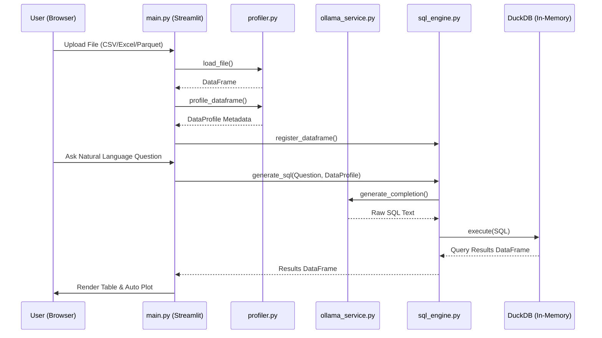

# Technical Architecture Documentation

This document describes the design patterns, code organization, and data flow of the **Local LLM Data Analyst** application.

---

## Architecture Blueprint

The project follows a clean, modular layer architecture separating UI representation, LLM generation, analytics computation, and system utilities:

```text
├── app/
│   ├── main.py              # Entry point coordinating state & views
│   ├── ui/                  # UI Customizations (Styles, KPI Cards, status indicators)
│   ├── services/            # Service Integrations (Ollama daemon check, auto-start, API)
│   ├── llm/                 # Chat logic & Conversation memory wrappers
│   ├── analytics/           # Computations (Data profiling, DuckDB SQL translator)
│   ├── charts/              # Visualizations (Plotly chart generator & recommendation rules)
│   └── reports/             # File Exporters (HTML, Markdown, A4 PDF report generation)
```

---

## Component Layers

### 1. Ingestion & Profiler (`app/analytics/profiler.py`)
- **File Loader**: Handles CSV, XLSX, XLS, and Parquet parsing, mapping extension types to standard readers (e.g. Pandas, openpyxl, and PyArrow).
- **DataFrame Profiler**: Synthesizes tabular metadata into typed Pydantic models. It calculates:
  - Exact memory usage in bytes, formatted into human-readable strings (KB/MB).
  - Column missing value counts and percentages.
  - Outliers using the Interquartile Range (IQR) method: $Q1 - 1.5 \times IQR$ and $Q3 + 1.5 \times IQR$.
  - Row duplicates using hashing.

### 2. DuckDB SQL Studio (`app/analytics/sql_engine.py`)
- **DuckDB Integration**: Runs an in-memory database instance. The loaded Pandas DataFrame is registered as a read-only view.
- **SQL Generation**: Constructs system prompts containing the exact table schema and column data types, prompting Ollama to write syntactically correct DuckDB SQL.
- **SQL Parser**: Strips LLM formatting wrappers (e.g. markdown code fences, loose quotation marks, trailing semicolons) to isolate the raw SQL command before passing it to the database driver.

### 3. LLM & Chat Interface (`app/llm/chat_engine.py`)
- **Sliding-Window Memory**: Retains conversation history. It limits retention to the last $N$ turns (user + assistant pairs) to preserve the context window of local LLMs.
- **Turn-level Eviction**: Evicts messages in pairs (2 at a time) rather than single messages to prevent conversational misalignment.
- **Data Context Injection**: Appends the active dataset's shape and schema description into the system instructions, allowing the chat assistant to answer database queries.

### 4. Interactive Charts (`app/charts/chart_generator.py`)
- **SaaS Dark Visuals**: Applies dark background layouts and gridlines matching the Vercel-style UI.
- **LLM Visual Advisor**: Queries the LLM to get recommended visualization settings (e.g., chart type, axes mapping, and labels) in a structured JSON response.
- **Logical Auto-Fallback**: If column specifications are missing, it scans data types to automatically pick the most logical chart:
  - 3+ numerical columns $\rightarrow$ Correlation Heatmap
  - Time column + numeric column $\rightarrow$ Trend Line Plot
  - Category column + numeric column $\rightarrow$ Bar Chart
  - Numerical column $\rightarrow$ Distribution Histogram

### 5. PDF & Document Exporter (`app/reports/report_generator.py`)
- **Markdown & HTML Exporters**: Interpolates dataset profile stats and LLM insights into GitHub-compatible Markdown and glassmorphic styled HTML templates.
- **Modern FPDF Layouts**: Uses the modern `fpdf2` new coordinate system (`new_x`, `new_y`, and `text`) to create structured, page-break aware executive PDF files.

---

## Data Lifecycle Diagram


